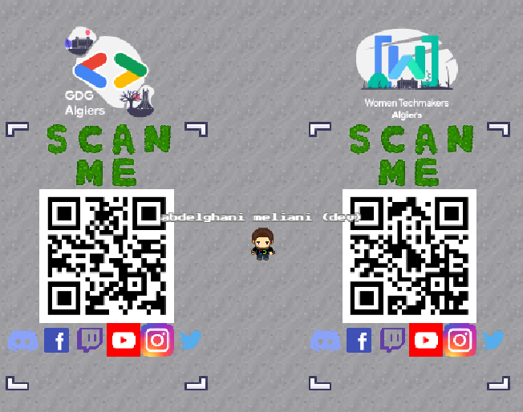

[![Contributors][contributors-shield]][contributors-url]
[![Forks][forks-shield]][forks-url]
[![Stargazers][stars-shield]][stars-url]

[![MIT License][license-shield]][license-url]

<!-- PROJECT LOGO -->
<br />
<p align="center">
   <a href="url"></a>
  <h3 align="center">BrainyBot 2.0</h3>

  <p align="center">
The Repository for BrainyBot 2.0 made with 
    <a href="https://discordjs.guide/">discord.js</a>
    <br />
    <br />
    <a href="https://github.com/GDGAlgiers/BrainyBot2.0">View Demo</a>
    ·
    <a href="https://github.com/GDGAlgiers/BrainyBot2.0/issues">Report Bug</a>
    ·
    <a href="https://github.com/GDGAlgiers/BrainyBot2.0/issues">Request Feature</a>
  </p>

<!-- TABLE OF CONTENTS -->
<details open="open">
  <summary><h2 style="display: inline-block">Table of Contents</h2></summary>
  <ol>
    <li>
      <a href="#about-the-project">About The Project</a>
      <ul>
        <li><a href="#built-with">Built With</a></li>
      </ul>
    </li>
    <li>
      <a href="#getting-started">Getting Started</a>
      <ul>
        <li><a href="#prerequisites">Prerequisites</a></li>
        <li><a href="#installation">Installation</a></li>
      </ul>
    </li>
    <li><a href="#usage">Usage</a></li>
    <li><a href="#project-structure">Project Structure</a></li>
    <li><a href="#contributing">Contributing</a></li>
    <li><a href="#license">License</a></li>
    <li><a href="#contact">Contact</a></li>
  </ol>
</details>

<!-- ABOUT THE PROJECT -->

## About The Project

Brainybot 2.0 is a free, open source multipurpose discord bot made by J it lives in Our GDG Algiers Server. Brainy offers many cool features.

### Built With

- [node.js](https://nodejs.org/)
- [discord.js](https://discordjs.guide/)

<!-- GETTING STARTED -->

## Getting Started

To get a local copy up and running follow these simple steps.

### Installation

1. Clone the repo and cd to it
  ```sh
  git clone https://github.com/GDGAlgiers/BrainyBot2.0.git
  cd BrainyBot2.0
  ```
2. Install Requirements
  ```sh
  npm install
  ```

<!-- USAGE EXAMPLES -->

## Usage

1. First you have to create a discord application and get an Application token, client id and guild id, check out the [documentation](https://discordjs.guide/#before-you-begin)
2. Setup `config.json`
  ```sh
  cp config.json.template config.json
  ```
3. Set your application token in the `config.json`
4. Running The bot
   ```sh
   npm run start
   ```

<!-- PROJECT STRUCTURE -->

## Project-Structure

The project is split into multiple categories where each category will hold a set of commands here are the current structure with **6 main categories**:

- 👩‍💼 **General**: `serverinfo`, `ping`, `server`, `poll` and **2** more!
- 🤖 **Mod**: `announce`
- 👻 **Fun**: `tweet`, `advice`, `photo`
- ✉️ **Help**: `help`
- 👑 **Owner**: `shutdown`, `say`, `embed`
- ✉️ **TechPoint**: `techpoint`, `note`, `res` and **3** more!

# Scan this qr code and join our community

|     link tree qr code      |
| :------------------------: |
|  |

<!-- LICENSE -->

## License

Distributed under the MIT License. See `LICENSE` for more information.

<!-- CONTACT -->

## Contact

GDG Algiers - [@gdg_algiers](https://twitter.com/gdg_algiers) - gdg.algiers@esi.dz

Project Link: [https://github.com/GDGAlgiers/BrainyBot2.0](https://github.com/GDGAlgiers/BrainyBot2.0)

<!-- MARKDOWN LINKS & IMAGES -->
<!-- https://www.markdownguide.org/basic-syntax/#reference-style-links -->

[contributors-shield]: https://img.shields.io/github/contributors/GDGAlgiers/BrainyBot2.0.svg?style=for-the-badge
[contributors-url]: https://github.com/GDGAlgiers/BrainyBot2.0/graphs/contributors
[forks-shield]: https://img.shields.io/github/forks/GDGAlgiers/BrainyBot2.0.svg?style=for-the-badge
[forks-url]: https://github.com/GDGAlgiers/BrainyBot2.0/network/members
[stars-shield]: https://img.shields.io/github/stars/GDGAlgiers/BrainyBot2.0.svg?style=for-the-badge
[stars-url]: https://github.com/GDGAlgiers/BrainyBot2.0/stargazers
[issues-shield]: https://img.shields.io/github/issues2.0/GDGAlgiers/BrainyBot2.0.svg?style=for-the-badge
[issues-url]: https://github.com/GDGAlgiers/BrainyBot2.0/issues
[license-shield]: https://img.shields.io/github/license/GDGAlgiers/BrainyBot2.0.svg?style=for-the-badge
[license-url]: https://github.com/GDGAlgiers/BrainyBot2.0/blob/master/LICENSE.txt
